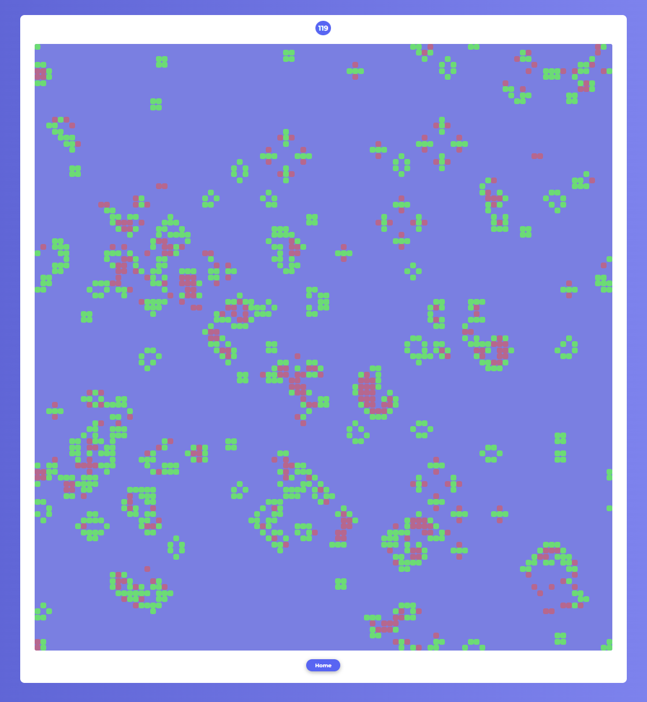

# Game of Life
[](https://github.com/FranChesK0/game-of-life/actions/workflows/pre-commit.yaml)
[](https://github.com/FranChesK0/game-of-life/actions/workflows/tests.yaml)

A web-based implementation of Conway's Game of Life using Python and the Flask framework.
<p align="center">
    
</p>

## Features
- Interactive simulation of Conway's Game of Life.
- Adjustable grid size.
- Easy setup and execution with Python and Flask

## Installation
1. Clone the repository:
```bash
git clone https://github.com/FranChesK0/game-of-life.git
cd game-of-life
```
2. Install dependencies:
    - using `pip`:
    ```bash
    pip install -r requirements.txt
    ```
    - using `poetry`:
    ```bash
    poetry install
    ```

## Usage
### Run the application
You can run the application using the following methods:
- With `make`:
```bash
make
```
- Manually:
```bash
python game-of-life/main.py
```
- Debug mode:
```bash
make debug
python game-of-life/main.py --debug
```

Then open the app `127.0.0.1:3000`

You can customize the server's address and port, and application secret key using environment variables:
- `GAME_OF_LIFE_ADDR`
- `GAME_OF_LIFE_PORT`
- `GAME_OF_LIFE_SECRET`

## License
This project is licensed under the MIT License. See the [LICENSE](./LICENSE) file for details.
